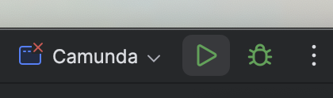

# Camunda BPM

## Overview

This project adds the integration of [Spring Security](https://projects.spring.io/spring-security/) with Camunda, so one can create an SSO solution based on Spring Security and the [Camunda Spring Boot starter](https://docs.camunda.org/manual/latest/user-guide/spring-boot-integration/).

The main idea is to offload authentication to Spring Security which then makes it easy to plug in any authentication mechanism.

## Onboard a new team/ tenant

- One off configuration is needed by teams to add tenant to Camunda. See [example PR](https://github.com/hmcts/camunda-bpm/pull/403)
- A member of chosen Azure AD Group chosen above should login into Camunda UI on that environment for the new tenant to show up.

## Optimize setup

- Docker image is imported to hmctsprivate from `registry.camunda.cloud` ( credentials in `rpe-prod` keyvault)
- Elastic search is added in [camunda-shared-infrastructure](https://github.com/hmcts/camunda-shared-infrastructure)
- Installed to AKS using [cnp-flux-config](https://github.com/hmcts/cnp-flux-config/tree/master/apps/camunda)
- It currently doesn't pick license on start up, we need to add it one-off per environment (license in `rpe-prod` keyvault)

## Developer setup

### Pre-requisites

Working on this Camunda BPM application requires the following:

- An IDE of choice and plugins for Java if required
    - [IntelliJ IDEA Community Edition](https://www.jetbrains.com/idea/download/) recommended but VSCode or similar also works
- OpenJDK 17 installed locally
    - [Jenv](https://www.jenv.be/) is recommended to keep your system Java clean
- [Docker](https://docs.docker.com/engine/install/) and [Docker-compose](https://docs.docker.com/compose/install/) installed
- Access to Azure Container Registry - hmctsprivate 
    - This is required if you want to pull the Jenkins built image to test locally, only in the event that a deployment to AKS is failing
    - You will also need Azure CLI installed to be able to log into this registry, its private which is why you need permissions to access.
- Access to Azure Key Vault 
    - rpe-prod
        - You need secrets for Camunda Enterprise to download the required packages during local builds
    - camunda-ithc
        - You need secrets for openId so we can test SSO works as expected
- Gradle installed - [install guide](https://gradle.org/install/)

    ```bash
    ------------------------------------------------------------
    Gradle 8.5
    ------------------------------------------------------------

    Build time:   2023-11-29 14:08:57 UTC
    Revision:     28aca86a7180baa17117e0e5ba01d8ea9feca598

    Kotlin:       1.9.20
    Groovy:       3.0.17
    Ant:          Apache Ant(TM) version 1.10.13 compiled on January 4 2023
    JVM:          21.0.2 (Homebrew 21.0.2)
    OS:           Mac OS X 14.3 x86_64
    ```

### Local setup

With all pre-requisites installed or available its time to setup locally.

Before making any changes you should test building from the master branch, this branch is a known working state so it should also therefore work when you build locally.

To build locally you need to set environment variables that contain the username and password from Azure Key Vault. 
These allow the build script to access Camundas private repository to download the required packages

```bash
export CAMUNDA_NEXUS_USER=<value from Key Vault>
export CAMUNDA_NEXUS_PASSWORD=<value from Key Vault>
```

### Local build

#### Build in the CLI

With those in place its possible to build the entire application now. From the root of the repository run:

```bash
./gradlew --no-daemon assemble  
```

This will begin the build process and if you see `BUILD SUCCESSFUL` then everything went well.

If you dont see this you will see an error and some useful output that shows where the might be an issue.
The most likely is the missing environment variables or pre-requisities, anything else should be reported as this is the master branch so it should not fail to build!!

When you have completed a build, you'll notice a new directory in your repository called `build`, this is the output of the build command and will contain a new jar file in `build/libs/camunda-bpm.jar` and this is the file we need to continue.

### Docker build

With the jar file in place you can now use Docker to build container images with that jar file and test the service locally.
Check out the `Dockerfile` in the repository, it will show the following lines:

```bash
COPY build/libs/camunda-bpm.jar /opt/app/

EXPOSE 8999

CMD ["camunda-bpm.jar"]
```

Here Docker will copy over the newly built jar file, and setup the image to run the jar file as its startup command i.e. start the app when we start the container.

You do not need to do anything with this file, docker-compose will use it to build an image when we run the right commands.

Before we do that though, its important to create an env file containing the required info to help Docker build:

```bash
CLIENT_ID=<value from Camunda-ITHC vault>
CLIENT_SECRET=<value from Camunda-ITHC vault>
SPRING_PROFILES_ACTIVE=springauth
```

These are environment variables defined in `docker-compose.yml` which have no defaults, we need to supply them here so that Camunda builds and runs just as it would in AKS.

It is possible to build without these values and Camunda will start without Single Sign On functionality, so you will need to have local Camunda credentials to log in (please check `src/main/resources/application.yaml` for these).

#### Docker Compose

With all of this in place you can now use docker compose to bring the service online locally

```bash
docker-compose --env-file <env file name created above> up -d
```

This command will build 2 new images and run those as containers for you, one containing the App and another is a generic Postgres Database that Camunda can acccess. The following shows the build output from this command:


When finish you can see whats running now by using `docker ps` and hopefully you will see 2 containers running:

```bash
docker ps

CONTAINER ID   IMAGE                              COMMAND                  CREATED              STATUS                        PORTS                    NAMES
fa3615cbb4e2   camunda-bpm-camunda-bpm            "/usr/bin/java -jar …"   About a minute ago   Up About a minute             0.0.0.0:8999->8999/tcp   camunda-bpm-camunda-bpm-1
a81bf23d4aaf   camunda-bpm-camunda-bpm-database   "docker-entrypoint.s…"   About a minute ago   Up About a minute (healthy)   0.0.0.0:5898->5432/tcp   camunda-bpm-camunda-bpm-database-1
```

The service runs by default on port `8999` and should be available by opening a browser and accessing `http://localhost:8999/`

If you have used the env file then you should be redirected to provider to complete your login otherwise you will see a Camunda log in page (check `/src/main/resources/application.yaml` for credentials).

When you are finished testing you can stop the containers by running:

```bash
docker-compose down
```

### IntelliJ setup

If you want to run or build the application via IntelliJ it is a simple button click process.

Open the Camunda repo folder in IntelliJ:


You'll need to setup a configuration for this application to let IntelliJ know what to do when you want to build.

Before doing this, you need to add the `src` directory as an IntelliJ module source, by navigating to File > Project Structure > Modules.
Click on the `src` folder, and then `Sources` in the menu, then click Appply.


Then in the same Project Structure window but under the `Dependencies` tab, add the Java SDK as a module dependency, as below:


You're now set up to add a configuration and can close the Project Structure window after applying changes.

In the top right of the window you will see `current file` and a drop down button, select this and then `edit configuration`:


Select `add new` and `application` in the new pop-up window:


Give the config a name and then select the field that shows `Main Class` to allow IntelliJ to discover the right class to use. If it is not showing up, you may need to use `Modify Options` and enable the `Use Classpath of module` option.


IntelliJ should automatically search and find the correct class for you so select it and click ok.

Back in the main config window, select the following information to complete this setup (note you need to ensure IntelliJ has access to your OpenJDK 17 install from the previous steps)


Just like Docker required additional environment variables, IntelliJ also needs these variables to ensure it can build correctly.
You can enter the variables via the in a single line separated by `;` or open the pop-up box and enter them individually which tends to be easier to view as well:


At a bare minimum, you will need to supply values for the environment variables:

- `CAMUNDA_NEXUS_USER`
- `CAMUNDA_NEXUS_PASSWORD`
- `CAMUNDA_DB_PASSWORD`
- `CAMUNDA_DB_PORT`

Please note, you will need to set `CAMUNDA_DB_PORT` to `5898` when using IntelliJ with the docker hosted DB.

With this setup you can start Camunda and log in with the Camunda admin user.

To use SSO locally, you will also need to supply the values of `CLIENT_ID`, `CLIENT_SECRET`, and `SPRING_PROFILES_ACTIVE` as environment variables as described above.

#### Running the application

With the configuration complete you are almost ready to run the application via IntelliJ. However Camunda requires a database and IntelliJ does not provide this functionality so we need to go back to Docker for this.

You can run the database via the docker-compose.yml file we used earlier. Run the following in your CLI to bring the database online:

```bash
docker-compose up -d camunda-bpm-database
```

This command is slighty different than before, we dont supply the env file because the database does not need any input and we specific the database container name because we only want the database container and not the app (it would conflict with IntelliJ).

Check the container is online by running `docker ps` and if everything is ready we can run the application now in IntelliJ.

Its important to remember we are `running` the application not building it yet!

Select the `play` button in IntelliJ to start the application:



Note: _If the `play` button is grayed out, re-opening IntelliJ can sometimes resolve this._

A new window will appear with a console to show the build progress of the application, this will also show logs from the application when you use the application which is very useful if you are troubleshooting a bug or issue:


In the console window, to the left, you will see steps that the process has completed or are in progress. Because we used the `run` option the application is running so this will never `complete` and you will see a progress/loader icon beside the main class, as long as the logs show no errors and this loader is showing then the application is ready to test


Open a browser and visit `http://localhost:8999/` just as we did with Docker and test the application.

Beside the `play` button in IntelliJ there is also a `stop` button, if you hit this and go back to your browser you'll see that the application is no longer available, this is because it was a live app not a built app like Docker had.

#### Building the application

Building the application via IntelliJ requires additional configuration, specifically a new config type.

Just like before we need to create a new config but this time it will be a `Gradle` type config


This will use the local `build.gradle` file to create the Jar that can then be tested in Docker.`

The settings are basic and non environment variables are required, once you have created the config, save and close the window.


Now its possible to swap between configurations, hitting the `play` button will now build the Jar file for us:


A new console window should appear, if not you can find the shortcuts to each of the window types in the bottom left of the IntelliJ window:


When the app is built with this method you can run it via the Docker compose steps detailed earlier in this guide.

### Local Development

Now that you have everything setup you can create your own branch and start making changes to the code.

Its highly recommended that you use IntelliJ or another IDE because it provides feedback on your code changes in realtime and will help with imports of dependencies should you need them as well as debugging should you need it.

Debugging is just running the application with extra logging and the ability to slow the application processes down to a step by step for troubleshooting. To run in debug mode, select the `bug` beside the play button.


Its also faster to run or debug your changes all in single window.
